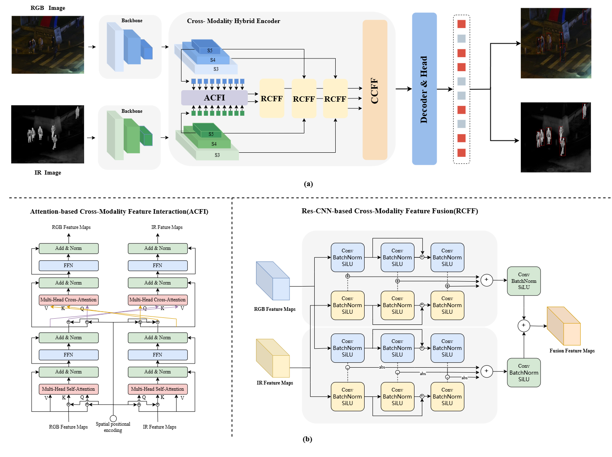

# Cross-Modality-Detect

## Intro
Official Code for [论文名称](论文网址).

the end-to-end Transformer-based cross-modality detectors

## Abstract
Cross-modality can integrate complementary information from different modalities to effectively improve the reliability and robustness of object detection. However, compared to processing unimodal inputs, cross-modality significantly increases the computational complexity of the model, which leads to huge memory consumption. In this paper, we propose a novel lightweight Cross-Modality Hybrid Encoder (CHE) that maintains low computational consumption while enhancing the performance of the detection model, which includes two modules designed by us: the Attention-based Cross-Modality Feature Interaction (ACFI) module for feature interaction within and between modalities, and the Res-CNN-based Cross-Modality Feature Fusion (RCFF) module for feature association and enhancement. Our method is tested on LLVIP, FLIR, and M3FD datasets. The experiments demonstrates a good performance. 
 Our proposed approach outperforms the state-of-the-art methods on mAP with 2.6\% on LLVIP, 1.1\% on FLIR, and 0.4\% on M3FD datasets. Additionally, our method requires only 79.7M parameters, significantly fewer than the 244.6M parameters of the SOTA method Fusion-Mamba, while maintaining high accuracy. This work represents the first exploration of DETR’s potential for cross-modality fusion.
## Overview

## Model Zoo

| Model | Dataset | Input Size | AP<sup>val</sup> | AP<sub>50</sub><sup>val</sup> | #Params(M) |
| :---: | :---: | :---: | :---: | :---: | :---: |
fusion_detr_r18vd | LLVIP | 640 | 66.6 | 96.1 | 44 |
fusion_detr_r18vd | FLIR | 640 | 42.2 | 77.2 | 44 |
fusion_detr_r18vd | M3FD | 640 | 58.1 | 86.9 | 44 |
fusion_detr_r50vd | LLVIP | 640 | 66.9 | 97.2| 80 |
fusion_detr_r50vd | FLIR | 640 | 45.5 | 81.9 | 80 |
fusion_detr_r50vd | M3FD | 640 | 62.3 | 90.8 | 80 |
fusion_detr_r101vd | LLVIP | 640 | 64.6 | 96.4 | 149 |
fusion_detr_r101vd | FLIR | 640 | 44.3 | 81.5 | 149 |
fusion_detr_r101vd | M3FD | 640 | 62.8 | 91.3 | 149 |


## Installation
```bash
https://github.com/CVandDetect/Cross-Modality-Detect.git
cd Cross-Modality-Detect
pip install -r requirements.txt
```
## Datasets
```
configs/dataset/data/
  train/    # train images
  val/      # val images
  instances_train/  
  instances_val/     # annotation json files
```
## Train

```shell
python tools/train.py -c configs/rtdetr/rtdetr_r50vd_6x_coco.yml
```

